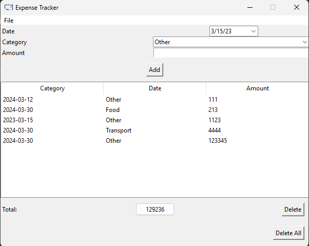

## Task_1
Сделать интерфейс с помощью Tkinter

### Пояснение
Программа "Учет расходов" на базе Tkinter

### Результат выполнения программы




## Листинг Task_1.py
```Py
import csv
import tkinter as tk
from tkinter import filedialog
from tkinter import ttk
from tkcalendar import DateEntry

class ExpenseTracker(tk.Tk):
    def __init__(self):
        super().__init__()
        self.title('Expense Tracker')
        self.setup_ui()

    def setup_ui(self):
        self.total_price = tk.IntVar(value=0)

        # Установка геометрии окна
        self.geometry('600x450')
        self.resizable(False, False)
        self.iconbitmap('icon.ico')

        # Создание меню файла
        self.menu = tk.Menu(self)
        self.config(menu=self.menu)
        self.file_menu = tk.Menu(self.menu, tearoff=False)
        self.menu.add_cascade(label="File", menu=self.file_menu)
        self.file_menu.add_command(label="Save", command=self.save_to_file)
        self.file_menu.add_command(label="Open", command=self.load_from_file)

        # Создание таблицы
        self.treeview = ttk.Treeview(columns=("Date", "Category", "Amount"), show="headings")
        self.treeview.heading("Date", text="Date",
                              command=lambda: self.treeview_sort(0, False, key=lambda x: tuple(map(int, x.split('-')))))
        self.treeview.heading("Category", text="Category",
                              command=lambda: self.treeview_sort(1, False))
        self.treeview.heading("Amount", text="Amount",
                              command=lambda: self.treeview_sort(2, False, key=int))
        self.treeview.grid(row=5, column=0)

        # Создание полей ввода
        # Дата
        self.date_label = tk.Label(master=self, text="Date")
        self.date_entry = DateEntry(self)
        # Категория
        self.category_label = tk.Label(master=self, text="Category")
        themes = ('Food', 'Apps', 'Entertainment', 'Transport', 'Other')
        self.category_combobox = ttk.Combobox(self, values=themes, width=47)
        self.category_combobox['state'] = 'readonly'
        self.category_combobox.set(themes[0])
        # Сумма
        self.sum_label = tk.Label(master=self, text="Amount")
        self.sum_entry = tk.Entry(master=self, validate="key",
                                  validatecommand=(self.register(self.validate_number), '%P'), width=50)
        self.sum_entry.insert(0, "0")
        self.sum_entry.bind('<FocusIn>', self.on_entry_click)
        self.sum_entry.bind('<FocusOut>', self.on_focusout)
        self.total_sum_label = tk.Label(master=self, text="Total: ")

        # Кнопки для работы с таблицей
        self.btn_del = tk.Button(master=self, text="Delete", command=self.delete)
        self.btn_del_all = tk.Button(master=self, text="Delete All", command=self.delete_all)
        self.total_sum_button = ttk.Button(textvariable=self.total_price)

        # Упаковка всех элементов
        self.date_label.grid(row=1, column=0, sticky="w")
        self.category_label.grid(row=2, column=0, sticky="w")
        self.sum_label.grid(row=3, column=0, sticky="w")
        self.date_entry.grid(row=1, column=0, sticky="e", padx=100)
        self.category_combobox.grid(row=2, column=0, sticky="e")
        self.sum_entry.grid(row=3, column=0, sticky="e")
        self.btn_add = tk.Button(master=self, text="Add", command=self.read_entry)
        self.btn_add.grid(row=4, column=0, padx=10, pady=10)
        self.treeview.grid(row=5, column=0)
        self.total_sum_label.grid(row=6, column=0, sticky="w")
        self.total_sum_button.grid(row=6, column=0, padx=10, pady=10, sticky="n")
        self.btn_del.grid(row=6, column=0, padx=10, pady=10, sticky="e")
        self.btn_del_all.grid(row=7, column=0, padx=10, pady=10, sticky="e")

    # Функция для ввода данных из полей в таблицу
    def read_entry(self):
        _date = self.date_entry.get_date()
        _category = str(self.category_combobox.get())
        _sum = self.sum_entry.get()
        if not _sum:
            _sum = "0"
        self.treeview.insert('', index='end', values=(_date, _category, _sum))
        self.calculate()
        self.sum_entry.delete(0, "end")
        self.sum_entry.insert(0, '0')
        self.focus_set()

    # Функция для подсчета общей суммы
    def calculate(self):
        total = 0
        for child in self.treeview.get_children():
            total += int(self.treeview.item(child, 'values')[2])
        self.total_price.set(total)

    # Функции для удаления строк из таблицы
    def delete(self):
        for selected in self.treeview.selection():
            self.treeview.delete(selected)
        self.calculate()

    def delete_all(self):
        for row in self.treeview.get_children():
            self.treeview.delete(row)
        self.calculate()

    # Функция для загрузки данных из файла
    def load_from_file(self):
        file_name = filedialog.askopenfilename(filetypes=[("CSV files", "*.csv"), ("All files", "*.*")])
        if not file_name:
            return
        # Очистка данных в treeview перед загрузкой новых данных из файла
        self.delete_all()
        with open(file_name, "r") as file:
            reader = csv.reader(file)
            next(reader)
            for row in reader:
                self.treeview.insert("", "end", values=row)
        self.calculate()

    # Функция для сохранения данных в файл
    def save_to_file(self):
        file_name = filedialog.asksaveasfilename(filetypes=[("CSV files", "*.csv"), ("All files", "*.*")])
        if not file_name:
            return
        with open(file_name, "w", newline='') as file:
            writer = csv.writer(file)
            writer.writerow(["Date", "Category", "Amount"])
            for row in self.treeview.get_children():
                writer.writerow(self.treeview.item(row)['values'])

    # Функция для сортировки таблицы
    def treeview_sort(self, col, reverse, key=str):
        l = [(self.treeview.set(k, col), k) for k in self.treeview.get_children("")]
        l.sort(reverse=reverse, key=lambda t: key(t[0]))
        for index, (_, k) in enumerate(l):
            self.treeview.move(k, "", index)
        self.treeview.heading(col, command=lambda: self.treeview_sort(col, not reverse, key=key))

    # Функция для валидации вводимой суммы
    def validate_number(self, num: str):
        if not num:
            self.entered_number = 0
            return True
        try:
            entered_number = int(num)
            if entered_number > 0 and num == str(entered_number):  # Проверка на положительное число без ведущих нулей
                self.entered_number = entered_number
                return True
            else:
                return False
        except ValueError:
            return False

    # Функции для добавления и удаления числа в поле "Amount"
    def on_entry_click(self, event):
        if self.sum_entry.get() == '0':
            self.sum_entry.delete(0, "end")
            self.sum_entry.insert(0, '')

    def on_focusout(self, event):
        if self.sum_entry.get() == '':
            self.sum_entry.insert(0, '0')


if __name__ == '__main__':
    app = ExpenseTracker()
    app.mainloop()
```

