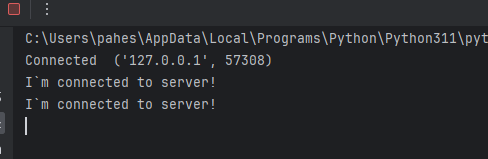
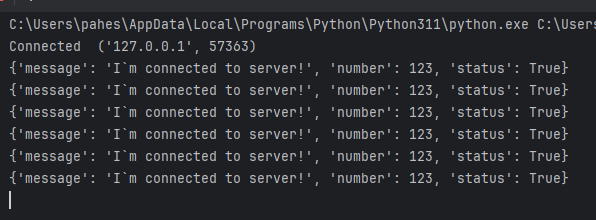
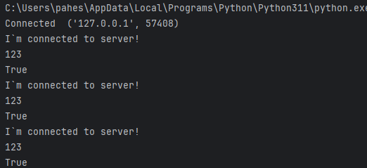
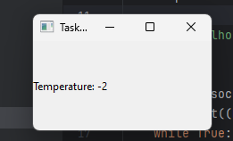

## Task_2_1


### Пояснение
Клиент отправляет каждую секунду я подключился используя encode() и decode()

### Результат выполнения программы


## Листинг 2_1_Server
```Py
import socket

HOST = 'localhost'
PORT = 12345

with socket.socket(socket.AF_INET, socket.SOCK_STREAM) as s:
    s.bind((HOST, PORT))
    s.listen(1)
    conn, addr = s.accept()
    with conn:
        print('Connected ', addr)
        while True:
            data = conn.recv(1024)
            x = data.decode()
            print(x)
```
## Листинг 2_1_Client
```Py
import socket
import time

HOST = 'localhost'
PORT = 12345

with socket.socket(socket.AF_INET, socket.SOCK_STREAM) as s:
    s.connect((HOST, PORT))
    txt = 'I`m connected to server!'
    x = txt.encode()

    while True:
        s.sendall(x)
        time.sleep(1)
```

## Task_2_2

### Пояснение
Клиент отправляет мапу с произвольными объектами каждую секунду используя pickle 

### Результат выполнения программы



## Листинг 2_2_Server
```Py
import socket
import pickle

HOST = 'localhost'
PORT = 12345

with socket.socket(socket.AF_INET, socket.SOCK_STREAM) as s:
    s.bind((HOST, PORT))
    s.listen(1)
    conn, addr = s.accept()
    with conn:
        print('Connected ', addr)
        while True:
            data = conn.recv(4096)
            if not data:
                break
            x = pickle.loads(data)
            print(x)
```
## Листинг 2_2_Client
```Py
import socket
import time
import pickle

HOST = 'localhost'
PORT = 12345

with socket.socket(socket.AF_INET, socket.SOCK_STREAM) as s:
    s.connect((HOST, PORT))
    data = {'message': 'I`m connected to server!', 'number': 123, 'status': True}
    serialized_data = pickle.dumps(data)

    while True:
        s.sendall(serialized_data)
        time.sleep(1)
```


## Task_2_3

### Пояснение
Клиент отправляет определенные структурированные данные из MyData используя Google Protocol Buffers

### Результат выполнения программы


## Листинг 2_3_Server

```Py
import socket
import data_pb2

HOST = 'localhost'
PORT = 12345

with socket.socket(socket.AF_INET, socket.SOCK_STREAM) as s:
    s.bind((HOST, PORT))
    s.listen(1)
    conn, addr = s.accept()
    with conn:
        print('Connected ', addr)
        while True:
            data = conn.recv(4096)
            if not data:
                break
            received_data = data_pb2.MyData()
            received_data.ParseFromString(data)
            print(received_data.message)
            print(received_data.number)
            print(received_data.status)
```
## Листинг 2_3_Client

```Py
import socket
import time
import data_pb2

HOST = 'localhost'
PORT = 12345

with socket.socket(socket.AF_INET, socket.SOCK_STREAM) as s:
    s.connect((HOST, PORT))
    data = data_pb2.MyData()
    data.message = 'I`m connected to server!'
    data.number = 123
    data.status = True

    while True:
        serialized_data = data.SerializeToString()
        s.sendall(serialized_data)
        time.sleep(1)
```

## Листинг data.proto
```
syntax = "proto3";

message MyData {
  string message = 1;
  int32 number = 2;
  bool status = 3;
}
```


## Task_2_4

### Пояснение
Клиент отправляет на сервер данные и выводит через Qt

### Результат выполнения программы


## Листинг 2_4_App
```py
import sys
from PySide6.QtWidgets import QApplication, QMainWindow, QLabel
from server import Server


class MainWindow(QMainWindow):
    def __init__(self):
        super().__init__()
        self.setWindowTitle("Task 2_4")
        self.label = QLabel()
        self.setCentralWidget(self.label)
        self.label.setText('Waiting for connection...')


def main():
    app = QApplication(sys.argv)
    window = MainWindow()
    window.show()
    _ = Server(window)
    sys.exit(app.exec())


if __name__ == "__main__":
    main()

```
## Листинг 2_4_Server
```Py
from PySide6.QtNetwork import QTcpServer
import data_pb2

t = data_pb2.Temperature()


class Server(QTcpServer):
    def __init__(self, window, parent=None):
        super().__init__(parent)
        self.mainWindow = window
        self.newConnection.connect(self.handleConnection)
        self.listen(port = 12345)

    def handleConnection(self):
        client_socket = self.nextPendingConnection()
        print(client_socket)
        client_socket.readyRead.connect(self.readData)

    def readData(self):
        client_socket = self.sender()  # ReadAll
        b = bytes(client_socket.readAll())
        t.ParseFromString(b)
        self.mainWindow.label.setText(('Temperature: ' + str(t.temp_cel)[0:2]))
```
## Листинг 2_4_Client
```Py
import socket
import time
import random
import data_pb2

temp = data_pb2.Temperature()
temp.temp_cel = 25


x = temp.SerializeToString()

HOST = 'localhost'
PORT = 12345

with socket.socket(socket.AF_INET, socket.SOCK_STREAM) as s:
    s.connect((HOST, PORT))
    while True:
        s.sendall(x)
        temp.temp_cel = random.uniform(-30, 30)
        x = temp.SerializeToString()
        time.sleep(1)
```
