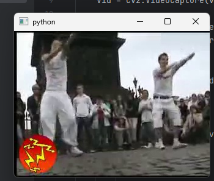

## Task_3
Передача видео client-server

### Пояснение
Программа выводит видео на сервер

### Результат выполнения программы



## Листинг Client
```Py
import cv2
import socket
import bytes_pb2
import time


def send_video_frames(video_path, host, port):
    t = bytes_pb2.my_image()
    vid = cv2.VideoCapture(video_path)

    with socket.socket(socket.AF_INET, socket.SOCK_STREAM) as s:
        s.connect((host, port))

        while True:
            ret, frame = vid.read()
            if not ret:
                break

            ret, buffer = cv2.imencode('.jpg', frame)
            if not ret:
                continue

            t.image = bytes(buffer)
            x = t.SerializeToString()
            message = len(x).to_bytes(4, byteorder='big') + x
            s.sendall(message)
            time.sleep(0.033)

    vid.release()


if __name__ == "__main__":
    send_video_frames('tik.mp4', 'localhost', 12345)
```

## Листинг Server
```Py
from PySide6.QtNetwork import QTcpServer
from PySide6.QtGui import QPixmap
import bytes_pb2

t = bytes_pb2.my_image()

class Server(QTcpServer):
    def __init__(self, window, parent=None):
        super().__init__(parent)

        self.mainWindow = window

        self._bytes = b''
        self._amount = 0
        self.newConnection.connect(self.handleConnection)
        self.listen(port = 12345)

    def handleConnection(self):
        client_socket = self.nextPendingConnection()
        print(client_socket)
        client_socket.readyRead.connect(self.readData)

    def readData(self):
        client_socket = self.sender() # ReadAll
        if(self._amount == 0):
            self._bytes = bytes(client_socket.read(4))
            self._amount = int.from_bytes(self._bytes)
            self._bytes = b''

        self._bytes += bytes(client_socket.read(self._amount - len(self._bytes)))
        if(self._amount - len(self._bytes) == 0):
            a = t.ParseFromString(self._bytes)
            pm = QPixmap()
            pm.loadFromData(t.image)
            self.mainWindow.status_label.setPixmap(pm)
            self._amount = 0
```


## Листинг App
```Py
import sys
from PySide6.QtWidgets import QApplication, QMainWindow, QLabel
from server import Server

class MainWindow(QMainWindow):
    def __init__(self):
        super().__init__()
        self.status_label = QLabel()
        self.setCentralWidget(self.status_label)

def main():
    app = QApplication([])
    window = MainWindow()
    window.show()
    _ = Server(window)
    sys.exit(app.exec())

if __name__ == "__main__":
    main()

```
